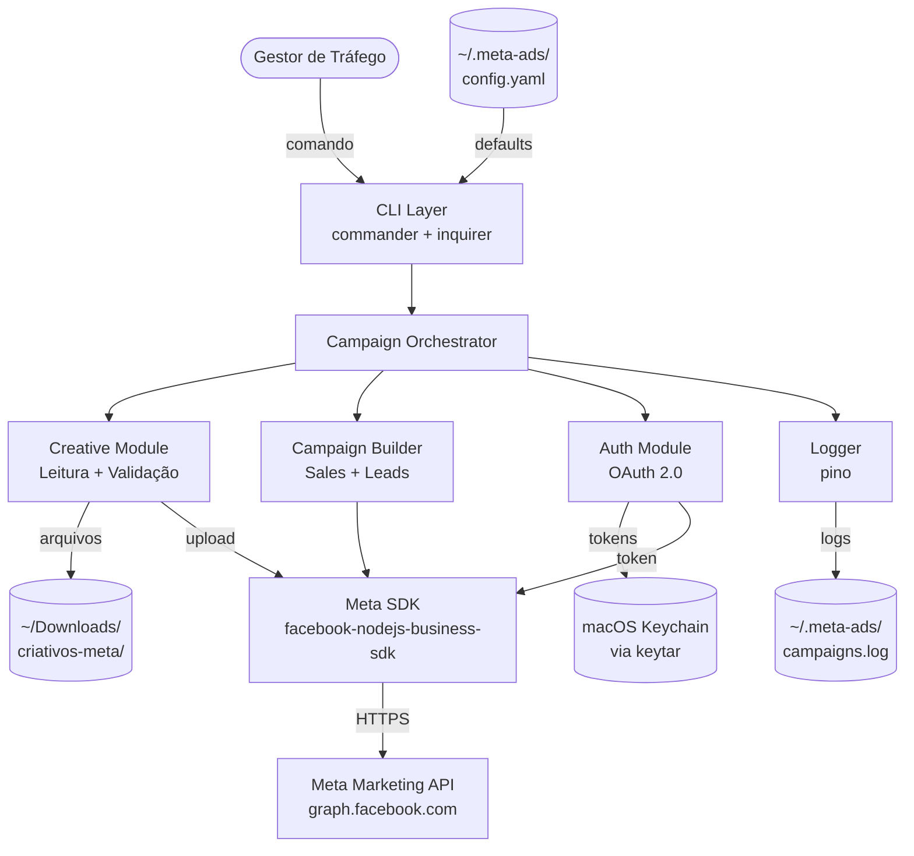
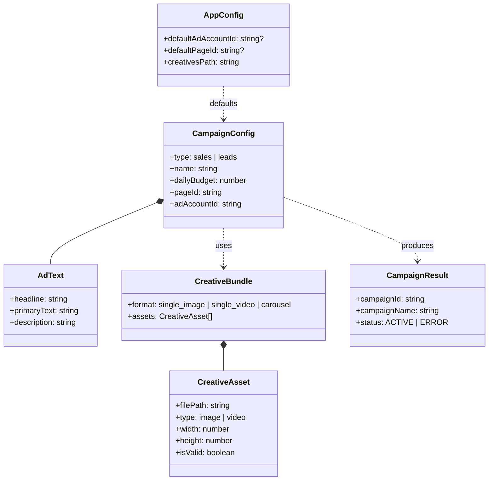
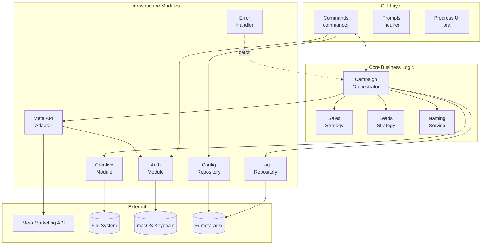
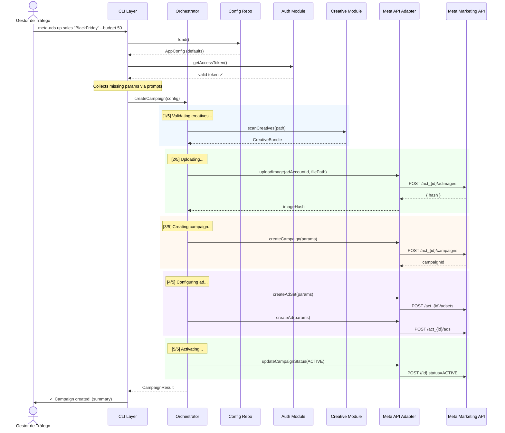
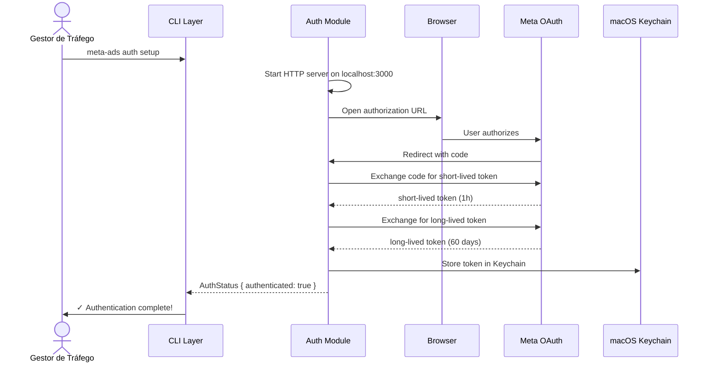
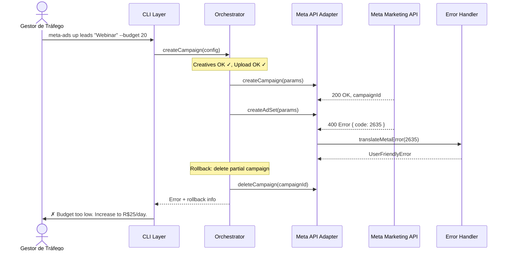

# Meta Ads Campaign Automation Agent — Architecture Document

| Date | Version | Description | Author |
|------|---------|-------------|--------|
| 09-03-26 | 0.1 | Initial architecture document | Aria (Architect) |

---

## Introduction

This document outlines the overall project architecture for the **Meta Ads Campaign Automation Agent**, a CLI application that automates the creation and activation of Sales and Leads campaigns on the Meta Ads platform. Its primary goal is to serve as the guiding architectural blueprint for AI-driven development, ensuring consistency and adherence to chosen patterns and technologies.

**Relationship to Frontend Architecture:** N/A — this project is exclusively CLI-based, with no graphical interface. No Frontend Architecture Document is needed.

### Starter Template or Existing Project

N/A — Greenfield project without starter template. The structure will be created from scratch in `packages/meta-ads-agent/` as part of the AIOX monorepo.

---

## High Level Architecture

### Technical Summary

The Meta Ads Agent is a monolithic CLI application in TypeScript following the **Pipeline Architecture** pattern — each command executes a linear sequence of steps (validate → upload → create → activate). The application communicates directly with the Meta Marketing API via the official SDK, stores tokens in the macOS Keychain, and maintains configurations and logs in local files. There is no server, database, or background service — it is an on-demand execution tool.

### High Level Overview

1. **Architectural Style:** Monolith CLI (Single Process) — command-line application that executes and terminates
2. **Repository Structure:** Monorepo — package in `packages/meta-ads-agent/` within the AIOX project
3. **Service Architecture:** Single Service — one CLI process orchestrating internal modules
4. **Primary Interaction Flow:**
   ```
   User → CLI (commander) → Campaign Orchestrator → [Creative Module + Meta API Module] → Meta Ads API → Terminal Output
   ```
5. **Key Decisions:**
   - Linear pipeline instead of event-driven (unnecessary complexity for CLI)
   - Official Meta SDK instead of direct HTTP calls (authentication and pagination abstraction)
   - Native Keychain instead of .env (real security for long-lived tokens)

### High Level Project Diagram



### Architectural and Design Patterns

- **Pipeline Pattern:** Each command executes sequential steps (validate → upload → create → activate). Each step is a pure function that receives input and returns output for the next. — _Rationale:_ Linear and predictable flow, easy to test each step in isolation, simple debugging.

- **Facade Pattern (Campaign Orchestrator):** A central orchestrator coordinates modules (Creative, Campaign, Auth) without the CLI knowing internal details. — _Rationale:_ Decouples the CLI interface from business logic, allows swapping module implementations without affecting commands.

- **Repository Pattern (Config & Logs):** Access to configurations and logs via abstractions (`ConfigRepository`, `LogRepository`) that hide the storage format (YAML, JSON). — _Rationale:_ Future migration from local files to DB or cloud only requires changing the repository implementation.

- **Strategy Pattern (Campaign Types):** `SalesCampaignStrategy` and `LeadsCampaignStrategy` implement the same `CampaignStrategy` interface, differing only in type-specific parameters. — _Rationale:_ Adding new campaign types (e.g., Traffic) in the future requires only a new strategy, without modifying the orchestrator.

- **Adapter Pattern (Meta SDK):** A `MetaApiAdapter` encapsulates the `facebook-nodejs-business-sdk`, exposing only necessary methods with strong typing. — _Rationale:_ Isolates the application from Meta API/SDK changes, facilitates mocking in tests.

---

## Tech Stack

### Cloud Infrastructure

- **Provider:** None — local CLI application, no cloud infrastructure in MVP
- **Key Services:** macOS Keychain (token storage), Local File System (config, logs)
- **Deployment Regions:** N/A — local execution on user's macOS

### Technology Stack Table

| Category | Technology | Version | Purpose | Rationale |
|----------|-----------|---------|---------|-----------|
| **Runtime** | Node.js | 22.x LTS | JavaScript runtime | Current LTS, native ESM support, AIOX compatible |
| **Language** | TypeScript | 5.7.x | Primary language | Type-safety critical for complex Meta API |
| **Meta API** | facebook-nodejs-business-sdk | 22.x | Official Meta Marketing API SDK | Abstracts auth, pagination, rate limits. Meta-maintained |
| **CLI Parser** | commander | 13.x | Command and flag parsing | Lightweight, mature, 0 dependencies, industry standard |
| **CLI Prompts** | @inquirer/prompts | 7.x | Interactive prompts | Modern ESM version, typed, validation support |
| **HTTP Client** | undici | built-in | Creative upload (multipart) | Native to Node.js 22, faster than axios, no extra dependency |
| **Validation** | zod | 3.24.x | Input and config validation | Native type inference, composable, custom messages |
| **Secure Storage** | keytar | 7.x | OAuth token storage | Uses native macOS Keychain, no credential files |
| **Logger** | pino | 9.x | Structured logging | Ultra-fast, native JSON, extensible with transports |
| **Logger (Dev)** | pino-pretty | 13.x | Terminal log formatting | Colors and readable formatting during development |
| **Progress UI** | ora | 8.x | Spinners and progress indicators | Lightweight, simple API, ANSI color support |
| **Image Metadata** | sharp | 0.33.x | Image dimension reading | Validates minimum resolution without loading full image |
| **Video Metadata** | ffprobe-static + fluent-ffmpeg | latest | Video metadata reading | Duration, resolution, codec — pre-upload validation |
| **Config Files** | yaml | 2.x | YAML config parse/write | Human-readable config (`~/.meta-ads/config.yaml`) |
| **Test Framework** | vitest | 3.x | Unit and integration tests | Fast, native ESM, TypeScript compatible without extra config |
| **Test Mocks** | msw | 2.x | HTTP request mocking (Meta API) | Intercepts at network layer, realistic tests |
| **Linter** | eslint | 9.x | Code quality | Flat config, TypeScript rules, ecosystem standard |
| **Formatter** | prettier | 3.x | Consistent formatting | Opinionated, zero configuration needed |
| **Build** | tsup | 8.x | TypeScript → JS bundling | Zero-config for CLI apps, tree-shaking, sourcemaps |
| **Package Manager** | npm | 10.x | Dependency management | Native to Node.js, no extra tooling |

---

## Data Models

This project does not use a database — models are TypeScript interfaces representing data in transit.

### CampaignConfig

**Purpose:** Complete campaign configuration assembled from user inputs and defaults.

**Key Attributes:**
- `type`: `'sales' | 'leads'` — Campaign type
- `name`: `string` — Ad name (used in naming)
- `dailyBudget`: `number` — Daily budget in cents (Meta API uses cents)
- `adText`: `AdText` — Ad texts (headline, body, description)
- `pageId`: `string` — Selected Facebook Page ID
- `instagramAccountId`: `string | null` — Connected Instagram ID
- `adAccountId`: `string` — Ad Account ID
- `landingPageUrl`: `string | null` — LP URL (required for leads, null for sales)
- `websiteUrl`: `string | null` — Website URL (for sales)

### AdText

**Purpose:** User-provided texts for the ad.

**Key Attributes:**
- `headline`: `string` — Ad headline
- `primaryText`: `string` — Primary text (body)
- `description`: `string` — Additional description
- `callToAction`: `CTA` — Call-to-action (e.g., `SHOP_NOW`, `LEARN_MORE`)

### CreativeAsset

**Purpose:** A creative file read from the local folder with validated metadata.

**Key Attributes:**
- `filePath`: `string` — Absolute file path
- `fileName`: `string` — File name
- `type`: `'image' | 'video'` — Detected type
- `mimeType`: `string` — MIME type (e.g., `image/jpeg`, `video/mp4`)
- `width`: `number` — Width in pixels
- `height`: `number` — Height in pixels
- `fileSize`: `number` — Size in bytes
- `duration`: `number | null` — Duration in seconds (video only)
- `isValid`: `boolean` — Validation result
- `validationErrors`: `string[]` — Validation errors (if any)

### CreativeBundle

**Purpose:** Groups campaign creatives and defines ad format.

**Key Attributes:**
- `format`: `'single_image' | 'single_video' | 'carousel'` — Detected format
- `assets`: `CreativeAsset[]` — Creative list (1 for single, 2-10 for carousel)
- `uploadedIds`: `Map<string, string>` — Map filePath → hash/ID after Meta upload

### AppConfig

**Purpose:** Persistent user settings saved in `~/.meta-ads/config.yaml`.

**Key Attributes:**
- `defaultAdAccountId`: `string | null` — Default Ad Account
- `defaultPageId`: `string | null` — Default Facebook Page
- `defaultInstagramId`: `string | null` — Default Instagram
- `creativesPath`: `string` — Creatives folder path (default: `~/Downloads/criativos-meta/`)
- `logPath`: `string` — Log file path

### CampaignResult

**Purpose:** Result of a successfully created campaign, for display and logging.

**Key Attributes:**
- `campaignId`: `string` — Meta campaign ID
- `campaignName`: `string` — Generated name (PPT_... pattern)
- `adSetId`: `string` — Ad set ID
- `adId`: `string` — Ad ID
- `type`: `'sales' | 'leads'` — Campaign type
- `dailyBudget`: `number` — Daily budget in reais
- `status`: `'ACTIVE' | 'PAUSED' | 'ERROR'` — Final status
- `creativeFormat`: `string` — Creative format used
- `adsManagerUrl`: `string` — Direct link to Ads Manager
- `createdAt`: `Date` — Creation timestamp

### Data Model Relationships



---

## Components

### 1. CLI Layer (`src/cli/`)

**Responsibility:** Application entry point. Registers commands, parses flags/arguments, collects inputs via interactive prompts, and displays formatted results in the terminal.

**Key Interfaces:**
- `meta-ads up <type> [name]` — Main creation command
- `meta-ads auth setup|status` — Authentication management
- `meta-ads accounts|pages` — Resource listing
- `meta-ads config set-default` — Default configuration
- `meta-ads history` — Campaign history

**Dependencies:** Campaign Orchestrator, Auth Module, Config Repository
**Technology Stack:** `commander`, `@inquirer/prompts`, `ora`

### 2. Campaign Orchestrator (`src/campaign/orchestrator.ts`)

**Responsibility:** Coordinates the complete campaign creation flow — the "conductor" that calls each module in the correct order and propagates errors. Implements the Pipeline Pattern.

**Key Interfaces:**
- `createCampaign(config: CampaignConfig, bundle: CreativeBundle): Promise<CampaignResult>`
- Internal pipeline: `validateInputs() → uploadCreatives() → createCampaign() → createAdSet() → createAd() → activateCampaign()`

**Dependencies:** Meta API Adapter, Creative Module, Naming Service, Logger
**Technology Stack:** Pure TypeScript

### 3. Campaign Strategies (`src/campaign/strategies/`)

**Responsibility:** Encapsulate configuration differences between campaign types. Each strategy knows which parameters to send to the Meta API.

**Key Interfaces:**
- `CampaignStrategy` (interface): `getCampaignObjective()`, `getOptimizationGoal()`, `getAdSetConfig()`, `getAdConfig()`
- `SalesCampaignStrategy` — objective `OUTCOME_SALES`, event `PURCHASE`
- `LeadsCampaignStrategy` — objective `OUTCOME_LEADS`, destination `WEBSITE`

**Dependencies:** None (pure logic)

### 4. Creative Module (`src/creative/`)

**Responsibility:** Reads files from the creatives folder, detects type (image/video/carousel), validates against Meta specs, and prepares for upload.

**Key Interfaces:**
- `scanCreatives(path: string): Promise<CreativeAsset[]>`
- `validateAsset(asset: CreativeAsset): ValidationResult`
- `buildBundle(assets: CreativeAsset[]): CreativeBundle`

**Dependencies:** Config Repository
**Technology Stack:** `sharp`, `fluent-ffmpeg` + `ffprobe-static`, `fs/promises`

### 5. Meta API Adapter (`src/meta-api/adapter.ts`)

**Responsibility:** Encapsulates all communication with the Meta Marketing API via the official SDK. Isolates the application from API/SDK changes.

**Key Interfaces:**
- `listAdAccounts(): Promise<AdAccount[]>`
- `listPages(): Promise<Page[]>`
- `uploadImage(adAccountId, filePath): Promise<string>`
- `uploadVideo(adAccountId, filePath, onProgress): Promise<string>`
- `createCampaign(params): Promise<string>`
- `createAdSet(params): Promise<string>`
- `createAd(params): Promise<string>`
- `updateCampaignStatus(id, status): Promise<void>`

**Dependencies:** Auth Module, Config Repository
**Technology Stack:** `facebook-nodejs-business-sdk`, `undici`

### 6. Auth Module (`src/auth/`)

**Responsibility:** Manages the complete OAuth 2.0 authentication cycle with Meta — from initial flow to token renewal.

**Key Interfaces:**
- `startAuthFlow(): Promise<void>`
- `getAccessToken(): Promise<string>`
- `getAuthStatus(): Promise<AuthStatus>`
- `isTokenExpiringSoon(days): boolean`

**Dependencies:** None (self-contained)
**Technology Stack:** `keytar`, native Node.js `http`

### 7. Naming Service (`src/campaign/naming.ts`)

**Responsibility:** Generates campaign names following the `PPT_[TYPE]_[EVENT]_[DATE]_[NAME]` pattern.

**Key Interfaces:**
- `generateCampaignName(type, name, date?): string`
- Example: `PPT_VENDAS_COMPRA_09-03-26_BlackFriday`

**Dependencies:** None

### 8. Config Repository (`src/config/`)

**Responsibility:** Reads and writes settings from `~/.meta-ads/config.yaml`.

**Key Interfaces:**
- `load(): Promise<AppConfig>`
- `save(config): Promise<void>`
- `getDefault(key): string | null`
- `setDefault(key, value): Promise<void>`

**Technology Stack:** `yaml`, `fs/promises`

### 9. Log Repository (`src/log/`)

**Responsibility:** Records created campaigns for auditing and history. Stores in JSON Lines format.

**Key Interfaces:**
- `logCampaign(result): Promise<void>`
- `getHistory(options): Promise<CampaignResult[]>`
- `exportCsv(results): string`
- `rotate(): Promise<void>`

**Technology Stack:** `pino`, `fs/promises`

### 10. Error Handler (`src/errors/`)

**Responsibility:** Translates Meta API errors to Portuguese messages with suggested actions. Centralizes error handling.

**Key Interfaces:**
- `translateMetaError(error): UserFriendlyError`
- `handleNetworkError(error): UserFriendlyError`
- `UserFriendlyError: { message, action, code }`

### Component Diagram



---

## External APIs

### Meta Marketing API

- **Purpose:** Primary API — all interaction with the Meta ads ecosystem (Facebook/Instagram)
- **Documentation:** https://developers.facebook.com/docs/marketing-apis
- **Base URL(s):** `https://graph.facebook.com/v21.0`
- **Authentication:** OAuth 2.0 Bearer Token (Long-Lived User Access Token, 60 days)
- **Rate Limits:** ~200 calls/hour per Ad Account (write operations), ~6400 calls/hour (read operations)

**Key Endpoints Used:**

| Method | Endpoint | Purpose |
|--------|----------|---------|
| `GET` | `/me/adaccounts` | List user's Ad Accounts |
| `GET` | `/me/accounts` | List Facebook Pages |
| `GET` | `/{page-id}?fields=instagram_business_account` | Get connected Instagram |
| `POST` | `/act_{id}/adimages` | Upload image (multipart) |
| `POST` | `/act_{id}/advideos` | Upload video (resumable) |
| `POST` | `/act_{id}/campaigns` | Create campaign |
| `POST` | `/act_{id}/adsets` | Create ad set |
| `POST` | `/act_{id}/ads` | Create ad |
| `POST` | `/{campaign-id}` | Update campaign status (ACTIVE) |
| `GET` | `/oauth/access_token` | Exchange code for token / extend token |

**Integration Notes:**
- SDK abstracts pagination, payload construction, and error handling
- Advantage+ configured by providing minimal targeting — Meta applies automatically
- Meta API v21.0 pinned; monitor deprecation calendar
- Sandbox mode available for development testing

### Meta OAuth 2.0 Flow

- **Documentation:** https://developers.facebook.com/docs/facebook-login/guides/advanced/manual-flow
- **Base URLs:** `facebook.com/v21.0/dialog/oauth` (authorize), `graph.facebook.com/v21.0/oauth/access_token` (token)
- **Authentication:** App ID + App Secret

**Complete Flow:**
1. CLI opens browser → `facebook.com/dialog/oauth?client_id=X&redirect_uri=http://localhost:3000/callback&scope=ads_management,ads_read,pages_read_engagement`
2. User authorizes → Meta redirects to `localhost:3000/callback?code=ABC`
3. CLI captures code → exchanges for short-lived token
4. CLI exchanges → short-lived → long-lived token (60 days)
5. CLI stores long-lived token in macOS Keychain

---

## Core Workflows

### Workflow 1: Complete Campaign Creation (main flow)



### Workflow 2: OAuth 2.0 Authentication



### Workflow 3: Error Flow with Rollback



---

## REST API Spec

N/A — This project does not expose a REST API. It is a CLI application that *consumes* the Meta Marketing API.

---

## Database Schema

No database. All storage is local files:

| Data | Format | Location |
|------|--------|----------|
| OAuth Token + App Secret | Encrypted (Keychain) | macOS Keychain via `keytar` |
| Configuration (defaults) | YAML | `~/.meta-ads/config.yaml` |
| Campaign history | JSON Lines | `~/.meta-ads/campaigns.log` |

### Config File Schema (`config.yaml`)

```yaml
version: 1
defaults:
  adAccountId: "act_123456789"
  pageId: "987654321"
  instagramAccountId: "111222333"
creativesPath: "~/Downloads/criativos-meta/"
logPath: "~/.meta-ads/campaigns.log"
app:
  appId: "444555666"
  callbackPort: 3000
```

### Campaign Log Schema (JSON Lines)

```json
{
  "campaignId": "120210123456",
  "campaignName": "PPT_VENDAS_COMPRA_09-03-26_BlackFriday",
  "adSetId": "120210789012",
  "adId": "120210345678",
  "type": "sales",
  "dailyBudget": 5000,
  "status": "ACTIVE",
  "creativeFormat": "carousel",
  "creativeFiles": ["img1.jpg", "img2.jpg"],
  "pageId": "987654321",
  "adsManagerUrl": "https://www.facebook.com/adsmanager/manage/campaigns?act=123456789&campaign_ids=120210123456",
  "createdAt": "2026-03-09T14:30:00.000Z"
}
```

---

## Source Tree

```
packages/meta-ads-agent/
├── src/
│   ├── cli/
│   │   ├── index.ts                # Entry point — registers commands
│   │   ├── commands/
│   │   │   ├── up.ts               # meta-ads up (main command)
│   │   │   ├── auth.ts             # meta-ads auth setup|status
│   │   │   ├── accounts.ts         # meta-ads accounts
│   │   │   ├── pages.ts            # meta-ads pages
│   │   │   ├── config.ts           # meta-ads config set-default
│   │   │   └── history.ts          # meta-ads history
│   │   ├── prompts.ts              # Interactive prompts (inquirer)
│   │   └── display.ts              # Output formatting (tables, summaries, colors)
│   │
│   ├── campaign/
│   │   ├── orchestrator.ts         # Campaign Orchestrator (pipeline)
│   │   ├── naming.ts               # Naming Service (PPT_VENDAS_...)
│   │   └── strategies/
│   │       ├── campaign-strategy.ts # CampaignStrategy interface
│   │       ├── sales.strategy.ts   # SalesCampaignStrategy
│   │       └── leads.strategy.ts   # LeadsCampaignStrategy
│   │
│   ├── creative/
│   │   ├── scanner.ts              # Reads and detects files from folder
│   │   ├── validator.ts            # Validates specs (dimensions, size, format)
│   │   └── bundle-builder.ts       # Builds CreativeBundle (single/carousel)
│   │
│   ├── meta-api/
│   │   ├── adapter.ts              # MetaApiAdapter (facade over SDK)
│   │   ├── uploader.ts             # Image and video upload
│   │   └── types.ts                # Meta API types (params, responses)
│   │
│   ├── auth/
│   │   ├── oauth-flow.ts           # OAuth 2.0 flow (browser + callback)
│   │   ├── token-manager.ts        # Token management (get, refresh, validate)
│   │   └── keychain.ts             # keytar abstraction (store/retrieve)
│   │
│   ├── config/
│   │   └── config-repository.ts    # Reads/writes ~/.meta-ads/config.yaml
│   │
│   ├── log/
│   │   └── log-repository.ts       # Campaign logging + history + rotation
│   │
│   ├── errors/
│   │   ├── error-handler.ts        # Meta error → Portuguese translation
│   │   ├── error-map.ts            # Error code → message map
│   │   └── types.ts                # UserFriendlyError, MetaApiError
│   │
│   └── types/
│       ├── campaign.ts             # CampaignConfig, CampaignResult, CampaignType
│       ├── creative.ts             # CreativeAsset, CreativeBundle
│       ├── config.ts               # AppConfig
│       └── auth.ts                 # AuthStatus, TokenInfo
│
├── tests/
│   ├── unit/
│   │   ├── campaign/
│   │   │   ├── orchestrator.test.ts
│   │   │   ├── naming.test.ts
│   │   │   └── strategies/
│   │   │       ├── sales.test.ts
│   │   │       └── leads.test.ts
│   │   ├── creative/
│   │   │   ├── scanner.test.ts
│   │   │   ├── validator.test.ts
│   │   │   └── bundle-builder.test.ts
│   │   ├── errors/
│   │   │   └── error-handler.test.ts
│   │   └── config/
│   │       └── config-repository.test.ts
│   ├── integration/
│   │   ├── campaign-flow.test.ts
│   │   ├── auth-flow.test.ts
│   │   └── upload.test.ts
│   ├── fixtures/
│   │   ├── images/
│   │   ├── config.yaml
│   │   └── meta-responses/
│   └── helpers/
│       ├── msw-handlers.ts
│       └── test-utils.ts
│
├── bin/
│   └── meta-ads.ts                  # Shebang entry point
│
├── package.json
├── tsconfig.json
├── tsup.config.ts
├── vitest.config.ts
├── .eslintrc.cjs
└── .prettierrc
```

---

## Infrastructure and Deployment

### Deployment Strategy

- **Strategy:** Local install via npm — package installed locally and linked for global use
- **CI/CD Platform:** GitHub Actions
- **Pipeline:** `.github/workflows/ci.yml`

```bash
# Local installation
cd packages/meta-ads-agent
npm install
npm run build
npm link          # makes 'meta-ads' globally available
```

### Environments

- **Development:** macOS local with Meta App in "Development Mode" (sandbox). Test token. Test creatives in `tests/fixtures/`.
- **Production:** User's macOS with real long-lived token (60 days). Real creatives in `~/Downloads/criativos-meta/`.

### Rollback Strategy

- **Primary Method:** `git revert` + rebuild
- **Trigger Conditions:** Campaign created with wrong config, production error after update
- **Recovery Time Objective:** < 5 minutes

### First-Time Setup

1. Create Meta App at developers.facebook.com → note App ID and App Secret
2. Install: `cd packages/meta-ads-agent && npm install && npm run build && npm link`
3. Authenticate: `meta-ads auth setup`
4. Configure defaults: `meta-ads accounts` → `meta-ads pages` → `meta-ads config set-default`
5. Create creatives folder: `mkdir ~/Downloads/criativos-meta/`
6. Ready: `meta-ads up sales "MyCampaign" --budget 50`

---

## Error Handling Strategy

### General Approach

- **Error Model:** Custom error hierarchy with 3 categories: `ValidationError`, `MetaApiError`, `AppError`
- **Exception Hierarchy:**
  ```
  AppError (base)
  ├── ValidationError
  ├── AuthError
  ├── MetaApiError
  │   ├── RateLimitError
  │   └── BudgetError
  ├── NetworkError
  └── CreativeError
  ```
- **Error Propagation:** Errors bubble from module → Orchestrator → Error Handler → CLI (UserFriendlyError only)

### Logging Standards

- **Library:** pino 9.x
- **Format:** JSON in production, pino-pretty in development
- **Levels:** fatal, error, warn, info, debug
- **Redact:** accessToken, appSecret, headers.authorization → `[REDACTED]`

### Error Translation Map

| Meta Error Code | Portuguese Message | Suggested Action |
|----------------|-------------------|-----------------|
| 190 | Token de acesso inválido ou expirado | Execute: `meta-ads auth setup` |
| 2635 | Orçamento diário abaixo do mínimo | Aumente para pelo menos R$X/dia |
| 100 | Parâmetro inválido: {param} | Verifique: {detalhe} |
| 4 | Limite de chamadas da API atingido | Aguarde alguns minutos |
| 10 | Permissão negada | Verifique permissões do Meta App |
| 17 | Conta atingiu o limite | Verifique limites de gastos |
| 2446 | Criativo rejeitado pela Meta | Verifique políticas de anúncios |
| 368 | Conta temporariamente bloqueada | Acesse o Gerenciador para resolver |

### Retry Policy

- 3 attempts with exponential backoff (1s, 3s, 9s) for 5xx errors
- No retry for 4xx errors (definitive)
- Rate limit (429): respect `Retry-After` header

### Rollback (Compensation)

```
Pipeline: validate → upload → createCampaign → createAdSet → createAd → activate

Failure at createAdSet:  → delete campaign
Failure at createAd:     → delete adSet + campaign
Failure at activate:     → delete ad + adSet + campaign
Rollback failure:        → log IDs for manual cleanup
```

---

## Coding Standards

### Core Standards

- **Language & Runtime:** TypeScript 5.7.x, Node.js 22.x LTS, ESM modules
- **Style & Linting:** ESLint 9.x flat config + `@typescript-eslint/recommended`, Prettier 3.x defaults
- **Test Organization:** `tests/unit/` mirrors `src/`, `tests/integration/` by flow

### Naming Conventions

| Element | Convention | Example |
|---------|-----------|---------|
| Files | kebab-case | `bundle-builder.ts` |
| Classes/Interfaces | PascalCase | `CampaignOrchestrator` |
| Functions/Methods | camelCase | `scanCreatives()` |
| Constants | UPPER_SNAKE | `MAX_IMAGE_SIZE` |
| Types/Enums | PascalCase | `CampaignType` |

### Critical Rules

1. **Never log tokens or App Secret** — use `pino.redact` for sensitive fields
2. **Always use cents internally** — conversion reais↔cents only in CLI layer
3. **Meta SDK types are unreliable** — always type returns in `MetaApiAdapter` with our interfaces
4. **Errors never reach user raw** — always pass through `ErrorHandler`
5. **Validate before calling API** — local validation first (token, creatives, budget)
6. **Max 200 lines per file** — extract module if larger
7. **Async/await everywhere** — never use `.then()/.catch()` chains
8. **Absolute imports** — use `@/` path alias, never `../../../`

### TypeScript Specifics

- `"strict": true` in tsconfig — no `any`, use `unknown` with type guards
- Zod for runtime validation of user inputs and API responses
- Union types over TypeScript enums

---

## Test Strategy and Standards

### Testing Philosophy

- **Approach:** Test-after
- **Coverage Goals:** 80%+ overall, 100% in `campaign/` and `creative/`
- **Test Pyramid:** ~40 unit, ~15 integration, ~5 E2E

### Test Types

**Unit Tests:** vitest 3.x, `vi.mock()` for mocking, AAA pattern
**Integration Tests:** MSW intercepting `graph.facebook.com`, temp directories for fixtures
**E2E Tests:** Manual runs against Meta API Sandbox (not in CI)

### Test Data

- **Fixtures:** `tests/fixtures/` — test images, config, meta responses
- **Factories:** `createCampaignConfig()`, `createCreativeAsset()`, `createCampaignResult()`
- **Cleanup:** `fs.mkdtemp()` per test, cleanup in `afterEach`

---

## Security

### Authentication & Authorization

- OAuth 2.0 with Long-Lived User Access Token (60 days)
- Stateless — token read from Keychain per execution
- Validate expiration BEFORE any operation

### Secrets Management

| Secret | Storage | keytar Service | keytar Account |
|--------|---------|---------------|----------------|
| Access Token | Keychain | `meta-ads-agent` | `access-token` |
| App Secret | Keychain | `meta-ads-agent` | `app-secret` |
| Token Expiry | Keychain | `meta-ads-agent` | `token-expiry` |

**Rules:** Never hardcode, never in CLI args, never in .env, access only via `keytar`

### Input Validation

- All user inputs validated with zod schemas
- Budget: `z.number().min(500)` (R$5 minimum in cents)
- URLs: `z.string().url()`
- Names: `z.string().min(1).max(100).regex(/^[a-zA-Z0-9À-ú\s\-_]+$/)`

### Data Protection

- **At Rest:** macOS Keychain (AES-256) for tokens. Logs and config in plaintext (no sensitive data)
- **In Transit:** HTTPS/TLS 1.3 for all Meta API communication
- **Logging:** pino redact for accessToken, appSecret, authorization headers

### Threat Model

| Threat | Risk | Mitigation |
|--------|------|------------|
| Token leaked in log | High | Pino redact, coding standards |
| Token in CLI args | High | Never accept token via flags |
| App Secret in file | High | Keychain only |
| OAuth callback intercepted | Low | Localhost only, 120s timeout |
| Malicious dependency | Medium | npm audit in CI |

---

## Checklist Results Report

### Executive Summary

- **Overall completeness:** ~94%
- **Architecture readiness:** READY FOR IMPLEMENTATION
- **Risk level:** Low — well-defined scope, single external API, local-only deployment

### Category Statuses

| Category | Status |
|----------|--------|
| High Level Architecture | PASS |
| Tech Stack | PASS |
| Data Models | PASS |
| Components | PASS |
| External APIs | PASS |
| Core Workflows | PASS |
| Source Tree | PASS |
| Infrastructure | PASS |
| Error Handling | PASS |
| Coding Standards | PASS |
| Test Strategy | PASS |
| Security | PASS |

### Open Investigation Items

1. **Advantage+ API fields** — @dev must investigate exact fields for Advantage+ audience configuration during Story 2.3
2. **keytar compatibility** — Monitor N-API compatibility with Node.js 22 during Story 1.2
3. **Video resumable upload** — Verify if `facebook-nodejs-business-sdk` supports progress callbacks during Story 2.2

### Final Decision

**READY FOR IMPLEMENTATION** — Architecture is complete, components are well-defined, patterns are appropriate for the scope. Proceed with Story Development Cycle.

---

## Next Steps

### Architect Prompt (Frontend)

N/A — CLI-only project, no frontend architecture needed.

### Dev Prompt

> @dev — Review the architecture document at `docs/architecture.md` and the PRD at `docs/prd.md`. Begin implementation with Epic 1, Story 1.1 (Project Scaffolding & CLI Bootstrap). Follow the source tree structure, coding standards, and patterns defined in the architecture. Use `packages/meta-ads-agent/` as the package root.

### SM Prompt

> @sm — Architecture is complete. Create the first story for implementation using `*draft`. Start with Epic 1, Story 1.1 from `docs/prd.md`.
